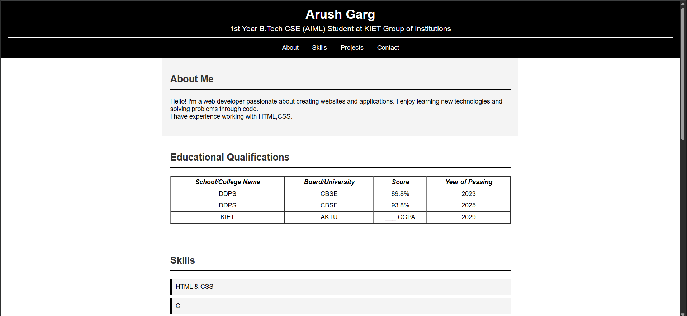
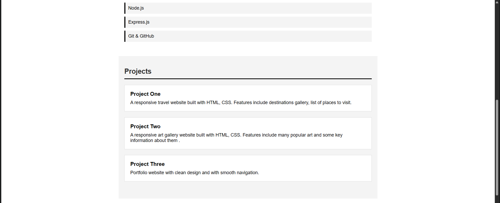
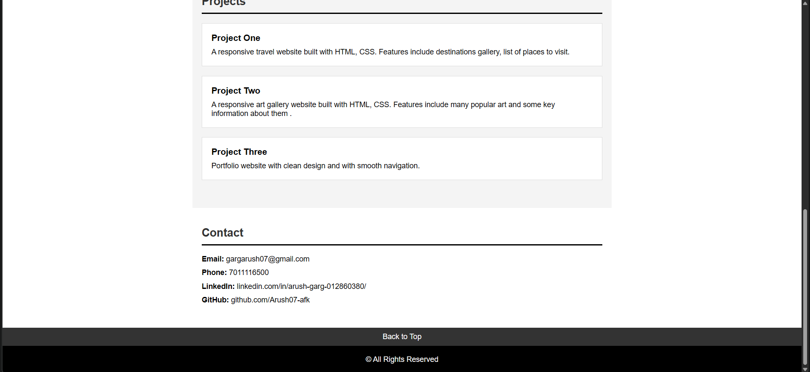

# Portfolio Website

A clean and responsive personal portfolio website showcasing my skills, projects, and educational background.

## 📋 Table of Contents

- [About](#about)
- [Features](#features)
- [Technologies Used](#technologies-used)
- [Sections](#sections)
- [Getting Started](#getting-started)
- [Screenshots](#screenshots)
- [Contact](#contact)

## 🎯 About

This is my personal portfolio website built as a 1st Year B.Tech CSE (AIML) student at KIET Group of Institutions. The website serves as a digital resume showcasing my educational qualifications, technical skills, and project work.

## ✨ Features

- **Responsive Design** - Works seamlessly across different screen sizes
- **Clean Navigation** - Easy-to-use navigation menu with smooth scrolling
- **Professional Layout** - Well-organized sections with clear visual hierarchy
- **Educational Timeline** - Detailed table of academic achievements
- **Project Showcase** - Highlighting completed projects with descriptions
- **Contact Information** - Multiple ways to get in touch

## 🛠️ Technologies Used

- HTML5
- CSS3
- Semantic HTML elements
- Flexbox layout
- CSS styling and animations

## 📑 Sections

1. **Header** - Name, current education, and navigation menu
2. **About Me** - Brief introduction and background
3. **Educational Qualifications** - Academic history in tabular format
4. **Skills** - List of technical skills and competencies
5. **Projects** - Showcase of completed projects
6. **Contact** - Email, phone, LinkedIn, and GitHub links
7. **Footer** - Copyright information and back-to-top navigation

## 🚀 Getting Started

### Prerequisites

- A modern web browser (Chrome, Firefox, Safari, Edge)
- No additional dependencies required

### Installation

1. Clone the repository
```bash
git clone https://github.com/Arush07-afk/portfolio-website.git
```

2. Navigate to the project directory
```bash
cd portfolio-website
```

3. Open the HTML file
```bash
# Simply open index.html in your web browser
# Or use a local server like Live Server in VS Code
```

### Usage

Simply open the `index.html` file in any web browser to view the portfolio website.

## 📸 Screenshots




## 🎨 Customization

To customize this portfolio for your own use:

1. Update personal information in the header section
2. Modify the About Me section with your own description
3. Update the educational qualifications table
4. Add your own skills to the skills list
5. Replace project descriptions with your projects
6. Update contact information with your details

## 📱 Responsive Design

The website is designed to be responsive and works well on:
- Desktop computers
- Tablets
- Mobile devices

## 🔮 Future Enhancements

- Add JavaScript for interactive elements
- Include project links and live demos
- Add smooth scroll animations
- Integrate a contact form
- Add dark mode toggle
- Include resume download option

## 📧 Contact

- **Name:** Arush Garg
- **Email:** gargarush07@gmail.com
- **Phone:** 7011116500
- **LinkedIn:** [linkedin.com/in/arush-garg-012860380/](https://linkedin.com/in/arush-garg-012860380/)
- **GitHub:** [github.com/Arush07-afk](https://github.com/Arush07-afk)

## 📄 License

© All Rights Reserved 

---

⭐ If you found this portfolio helpful, please consider giving it a star!

**Made with ❤️ by Arush Garg**
